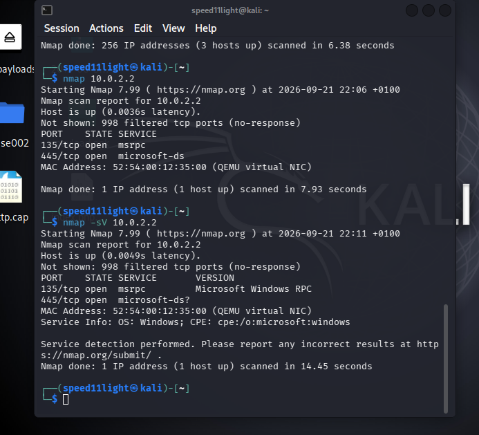
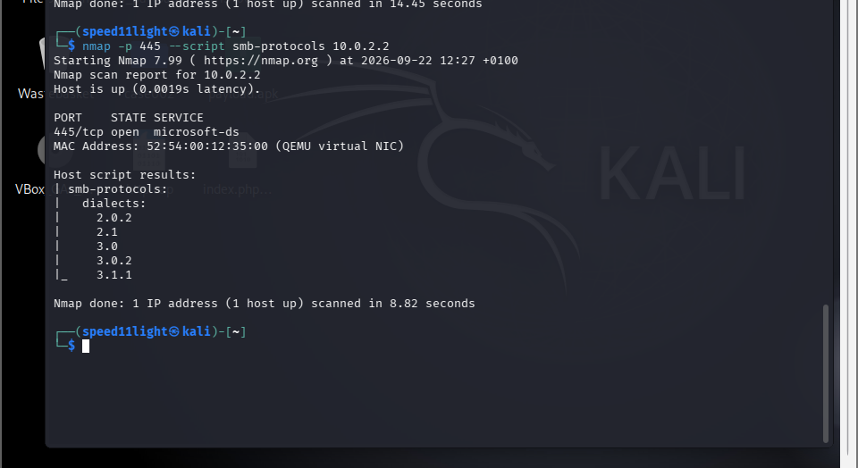
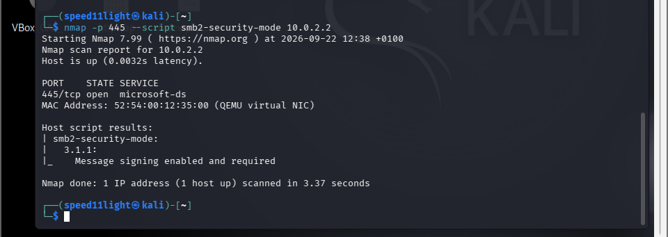
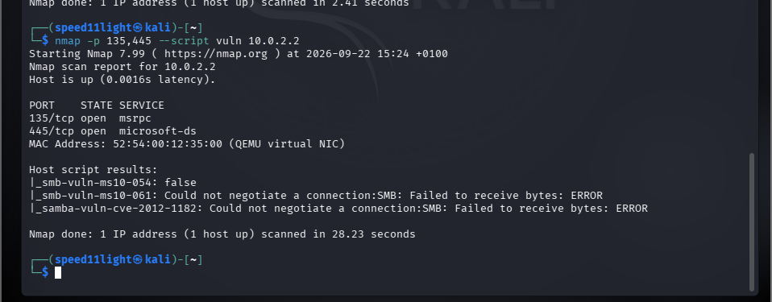
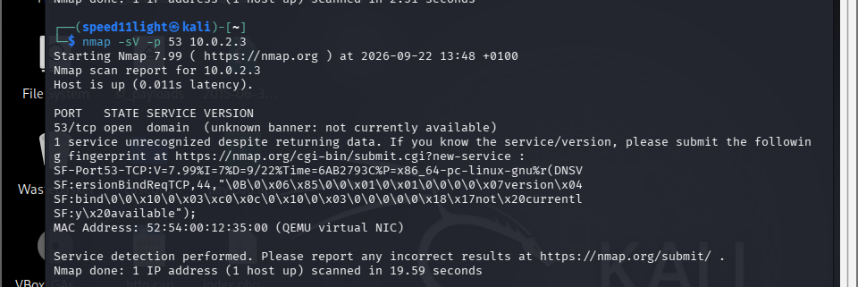
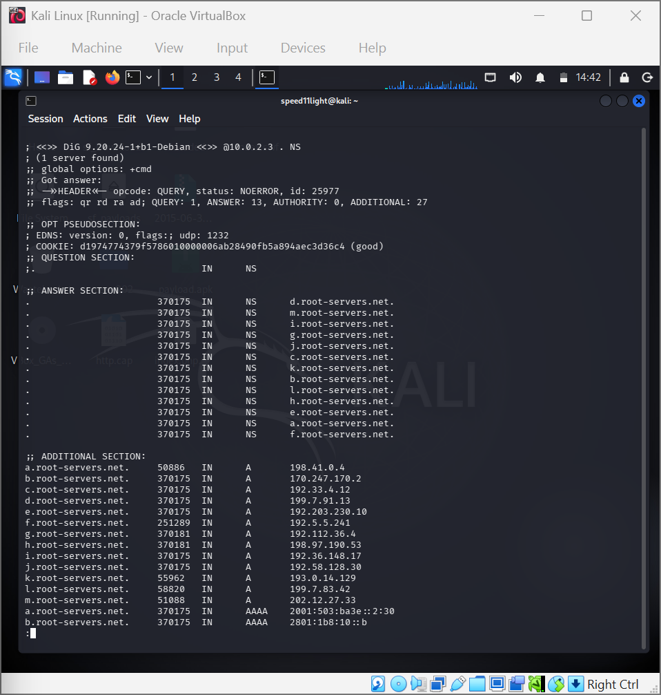
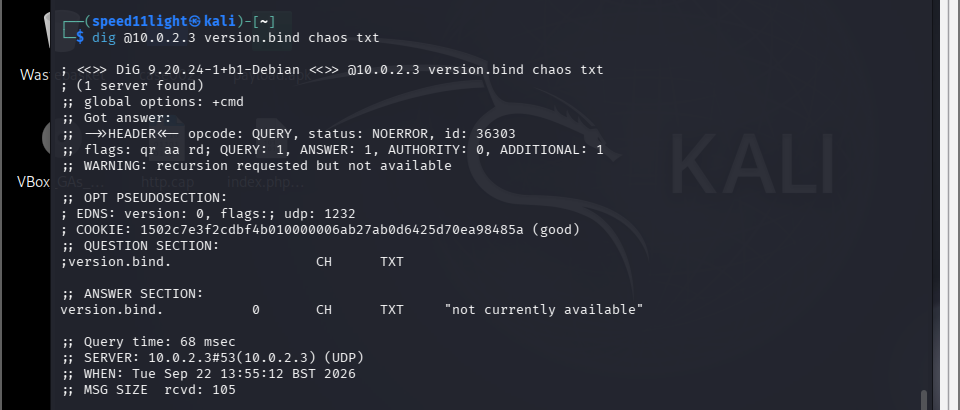
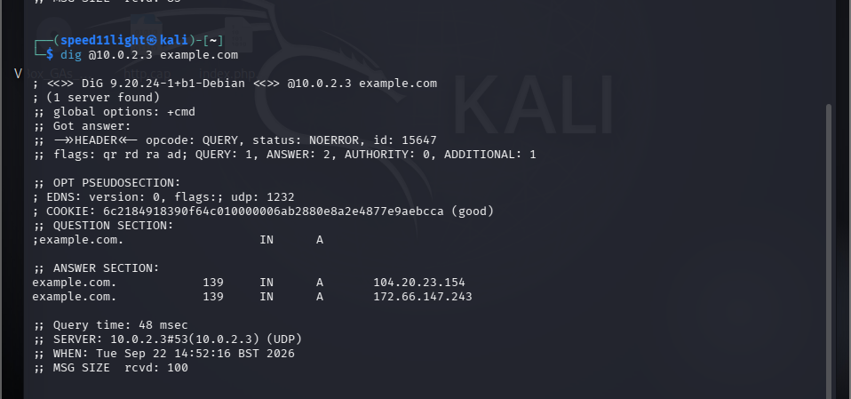
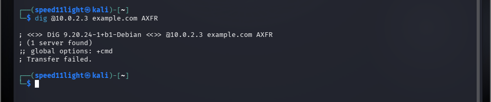
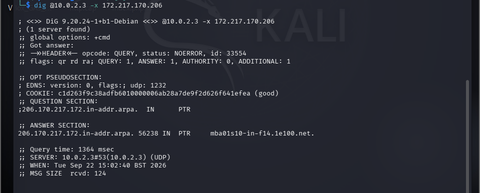

# kali-linux-security-lab
A hands-on Kali Linux security lab covering network reconnaissance, service enumeration, and basic security assessment.

## 🎯 Objectives

* Identify active hosts and open ports on the authorized lab targets `10.0.2.2` and `10.0.2.3`, which are on the same `10.0.2.0/24` network as my Kali Linux machine (`10.0.2.15`).
* Identify the services running on the discovered open ports.
* Enumerate selected SMB, MSRPC, and DNS services to understand their configurations and security controls.
* Perform basic security checks to identify potential weaknesses and determine whether any confirmed vulnerabilities were present.
* Document the reconnaissance, enumeration, and assessment results using terminal evidence and screenshots.

## 🧪 Lab Environment

* **Operating System:** Kali Linux
* **Virtualization:** Oracle VirtualBox
* **Kali VM IP:** `10.0.2.15`
* **Network:** `10.0.2.0/24`
* **Target 1:** `10.0.2.2`
* **Target 2:** `10.0.2.3`

The assessment was conducted within an authorized virtual lab environment. The `10.0.2.0/24` network was scanned to identify active hosts, open ports, running services, and selected security configurations.

## 🔎 Reconnaissance & Host Discovery

I began by scanning the `10.0.2.0/24` network range with Nmap to identify active hosts.

The scan identified three responding hosts:

* `10.0.2.2`
* `10.0.2.3`
* `10.0.2.15` — my Kali Linux VM

The two other responding hosts were selected for further service enumeration and security assessment.

### 📸 Evidence




## 🖥️ SMB and MSRPC Enumeration

Further enumeration of the host `10.0.2.2` identified two open TCP ports:

* **Port 135** — MSRPC (Microsoft Remote Procedure Call)
* **Port 445** — SMB (Server Message Block)
  
Port 445 was investigated further to understand the SMB service and its security configuration.

### SMB Protocol Enumeration

The supported SMB dialects were enumerated using Nmap. The host reported support for:

* SMB 2.0.2
* SMB 2.1
* SMB 3.0
* SMB 3.0.2
* SMB 3.1.1

This showed that the host supports multiple SMB protocol versions, including the newer SMB 3.1.1 dialect.

### SMB Message Signing

The SMB security configuration was then checked to determine whether message signing was enabled and required.

The result showed:

**Message signing: Enabled and Required**

Requiring SMB message signing is an important security control because it helps protect SMB communications against certain forms of tampering and man-in-the-middle attacks.

### Assessment

The enumeration confirmed that SMB was exposed on TCP port 445 and that message signing was enabled and required. No security weakness was established from the SMB protocol enumeration or signing check alone.

### 📸 Evidence






## 🛡️ SMB Vulnerability Assessment

After enumerating the SMB service, a vulnerability scan was performed against the exposed SMB and MSRPC ports using Nmap's vulnerability detection scripts.

```bash
nmap -p 135,445 --script vuln 10.0.2.2
```

The scan produced three relevant results:

| Vulnerability Check        | Result              | Interpretation                                                          |
| -------------------------- | ------------------- | ----------------------------------------------------------------------- |
| `smb-vuln-ms10-054`        | **False**           | The check did not detect MS10-054 on the target.                        |
| `smb-vuln-ms10-061`        | **Test incomplete** | SMB negotiation could not be completed, so the result was inconclusive. |
| `samba-vuln-cve-2012-1182` | **Test incomplete** | SMB negotiation could not be completed, so the result was inconclusive. |

### Assessment

The scan **did not confirm a vulnerability** on `10.0.2.2`.

One vulnerability check returned a negative result, while two checks could not be completed because the required SMB connection negotiation failed. Therefore, the two incomplete checks should be treated as **inconclusive**, rather than as evidence that the target was either vulnerable or not vulnerable.

This demonstrates the importance of distinguishing between a vulnerability that was **not detected** and a security test that **could not be completed**.

### 📸 Evidence



## 🌐 DNS Enumeration

The initial scan of `10.0.2.3` identified **TCP port 53** as open and associated with the DNS service. Further enumeration was performed to understand the DNS service, determine whether software/version information was disclosed, and examine selected DNS functions.

### DNS Service and Version Detection

The following command was used:

```bash
nmap -sV -p 53 10.0.2.3
```

Nmap identified port 53 as a DNS service but could not determine the exact DNS software or version.

### 📸 Evidence



### DNS Root Nameserver Query

A query for the root zone's nameserver records was performed to observe how the DNS server responded to a request for root DNS information:

```bash
dig @10.0.2.3 . NS
```

The server successfully returned the nameserver records for the DNS root zone.

This demonstrated that the DNS service was able to process and respond to queries for root nameserver information.

### 📸 Evidence




### DNS Version Query

A DNS version query was then performed:

```bash
dig @10.0.2.3 version.bind chaos txt
```

The server responded with:

```text
"not currently available"
```

This indicated that the DNS server did not disclose its software/version through this query.

### 📸 Evidence



### Recursive DNS Resolution

A recursive DNS query was performed to determine whether the server could resolve an external domain:

```bash
dig @10.0.2.3 example.com
```

The query successfully returned an IP address for `google.com`. The response flags included:

* `rd` — Recursion Desired
* `ra` — Recursion Available

This provided evidence that recursive DNS resolution was available for the query.

Recursive DNS is not automatically a vulnerability, but its availability should be assessed against the intended network design and access controls.

### 📸 Evidence



### DNS Zone Transfer (AXFR)

A zone transfer was tested using:

```bash
dig @10.0.2.3 example.com AXFR
```

The result was:

```text
Transfer failed.
```

The requested zone transfer was therefore unsuccessful, and the server did not disclose the zone through this AXFR request.

### 📸 Evidence



### Reverse DNS Lookup

A reverse DNS lookup was performed using:

```bash
dig @10.0.2.3 -x 172.217.170.206
```

The query successfully returned the hostname:

```text
mba01s10-in-f14.1e100.net.
```

This demonstrated successful reverse DNS resolution, mapping the IP address `172.217.170.206` to an associated hostname.

### 📸 Evidence



### Assessment

The DNS enumeration confirmed that `10.0.2.3` provides DNS service on TCP port 53 and can perform recursive resolution. The server did not disclose its software/version through the version query, and the tested AXFR request failed. Reverse DNS resolution was successful.

No confirmed DNS vulnerability was established from these tests alone.

## 🔎 Security Assessment & Findings

The assessment identified security-related observations on both hosts, but the available evidence was not sufficient to confirm a vulnerability.

### Host 10.0.2.2 — SMB

TCP port 445 was open and associated with SMB. Multiple SMB dialects were supported, including SMB 3.1.1.

The SMB security-mode check reported that **message signing was enabled and required**. This is an important security control because SMB message signing helps protect communications against certain forms of tampering and man-in-the-middle attacks.

The vulnerability scan did not confirm an SMB vulnerability. One check returned a negative result, while two checks were inconclusive because SMB negotiation could not be completed.

### Host 10.0.2.3 — DNS

TCP port 53 was open and associated with DNS. Recursive DNS resolution was available for the query tested.

A DNS zone transfer (AXFR) was also tested, but the request failed. Therefore, the DNS zone was **not disclosed through the tested AXFR request**.

The DNS server also did not disclose its software/version through the version query we performed.

### Overall Assessment

The investigation identified exposed SMB and DNS services and examined selected security configurations and DNS functions. The evidence collected did not confirm a specific vulnerability on either host.

Some tests were inconclusive, so the results should be interpreted within the scope and limitations of the tests performed rather than treated as proof that the systems are completely secure.


## 🧠 What I Learned

This lab helped me understand that security assessment is more than identifying open ports. An open port is an observation that requires further investigation; it does not automatically mean that a vulnerability exists.

I learned to:

* Use Nmap for host discovery, service detection, and targeted enumeration.
* Understand the relationship between ports, services, and protocols.
* Investigate SMB by identifying supported dialects and checking security controls such as message signing.
* Interpret vulnerability scan results carefully, distinguishing between vulnerabilities that were not detected and tests that were inconclusive.
* Use `dig` to investigate DNS functionality, including recursive resolution, zone transfers, and reverse DNS.
* Treat security findings according to the evidence collected rather than making assumptions.
* Understand that a test result can be limited or inconclusive and should be reported honestly.
* Recognize that security assessment involves asking questions about a service and investigating the answers, rather than simply looking for open ports.

